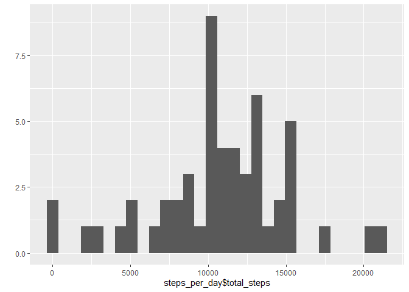
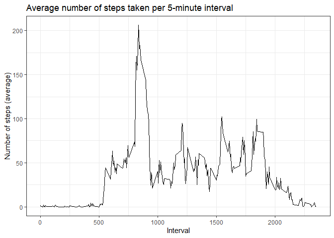
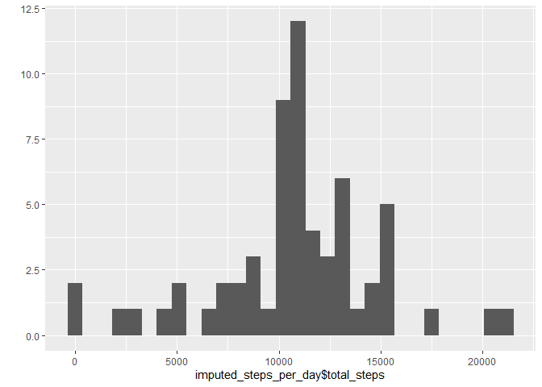
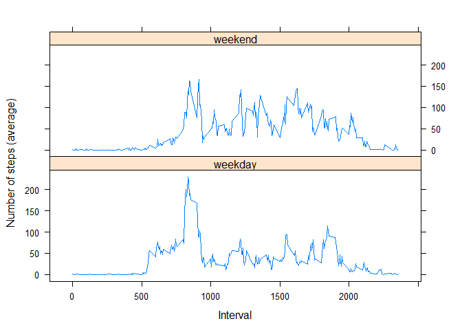

## Libraries

```r
library(tidyverse)
```

```
## -- Attaching packages ----------------------------------------------------------------------------------------- tidyverse 1.2.1 --
```

```
## v ggplot2 3.2.1     v purrr   0.3.3
## v tibble  2.1.3     v dplyr   0.8.3
## v tidyr   1.0.0     v stringr 1.4.0
## v readr   1.3.1     v forcats 0.4.0
```

```
## -- Conflicts -------------------------------------------------------------------------------------------- tidyverse_conflicts() --
## x dplyr::filter() masks stats::filter()
## x dplyr::lag()    masks stats::lag()
```

```r
library(lattice)
```


## Loading and preprocessing the data

```r
data <- read_csv("activity.zip", col_types = list(col_integer(), col_date(), col_integer()))
```

## What is mean total number of steps taken per day?

### 1. Calculate the total number of steps taken per day

```r
steps_per_day <- data %>%
  group_by(date) %>%
  summarise(total_steps = sum(steps)) %>%
  ungroup()

head(steps_per_day, 5)
```
### 2. Make a histogram of the total number of steps taken each day

```r
qplot(steps_per_day$total_steps)
```

```
## `stat_bin()` using `bins = 30`. Pick better value with `binwidth`.
```

```
## Warning: Removed 8 rows containing non-finite values (stat_bin).
```

<!-- -->

### 3. Calculate and report the mean and median of the total number of steps taken per day

```r
mean_steps <- mean(steps_per_day$total_steps, na.rm = TRUE)
median_steps <- median(steps_per_day$total_steps, na.rm = TRUE)
```

The mean number of steps per day is 1.0766189\times 10^{4} and the median is 10765.

## What is the average daily activity pattern?

### 1. Make a time series plot (i.e. type = "l") of the 5-minute interval (x-axis) and the average number of steps taken, averaged across all days (y-axis)

```r
avg_steps_per_interval <- data %>%
  group_by(interval) %>%
  summarise(avg_steps = mean(steps, na.rm = TRUE)) %>%
  ungroup()

ggplot(avg_steps_per_interval, aes(interval, avg_steps)) +
  geom_line() +
  labs(
    title = "Average number of steps taken per 5-minute interval",
    y = "Number of steps (average)",
    x = "Interval"
  ) +
  theme_bw()
```

<!-- -->

### 2. Which 5-minute interval, on average across all the days in the dataset, contains the maximum number of steps?

```r
max_steps_interval <- avg_steps_per_interval[which.max(avg_steps_per_interval$avg_steps), 1]
max_steps_value <- avg_steps_per_interval[which.max(avg_steps_per_interval$avg_steps), 2]
```

The 5-minute interval with the most steps (on average) is 835 with 206.1698113 steps.


## Imputing missing values
### 1. Calculate and report the total number of missing values in the dataset (i.e. the total number of rows with NAs)

```r
incomplete_rows <- sum(!complete.cases(data))
total_rows <- nrow(data)
```
Out of 17568 observations, 2304 contain missing values.

### 2. Devise a strategy for filling in all of the missing values in the dataset.
Data will be imputed by replacing missing values with the average for that 5-minute interval.

### 3.Create a new dataset that is equal to the original dataset but with the missing data filled in.

```r
imputed_data <- data %>%
  left_join(avg_steps_per_interval, by = "interval") %>%
  mutate(steps = coalesce(steps, as.integer(avg_steps))) %>%
  select(-avg_steps)

head(imputed_data)
```

```
## # A tibble: 6 x 3
##   steps date       interval
##   <int> <date>        <int>
## 1     1 2012-10-01        0
## 2     0 2012-10-01        5
## 3     0 2012-10-01       10
## 4     0 2012-10-01       15
## 5     0 2012-10-01       20
## 6     2 2012-10-01       25
```

### 4. Make a histogram of the total number of steps taken each day and Calculate and report the mean and median total number of steps taken per day. 

```r
imputed_steps_per_day <- imputed_data %>%
  group_by(date) %>%
  summarise(total_steps = sum(steps)) %>%
  ungroup()

qplot(imputed_steps_per_day$total_steps)
```

```
## `stat_bin()` using `bins = 30`. Pick better value with `binwidth`.
```

<!-- -->

```r
imputed_mean_steps <- mean(imputed_steps_per_day$total_steps, na.rm = TRUE)
imputed_median_steps <- median(imputed_steps_per_day$total_steps, na.rm = TRUE)
```

The mean number of steps per day after imputation is 1.074977\times 10^{4} and the median is 10641.

*Do these values differ from the estimates from the first part of the assignment? What is the impact of imputing missing data on the estimates of the total daily number of steps?*
Yes, both the total number of steps as well as the mean and median change as a result of imputation. The total number of steps increases as there are more observations to count. The median is slightly lower as a result of choosing mean values per 5-minute interval to replace missing values.

## Are there differences in activity patterns between weekdays and weekends?

### 1. Create a new factor variable in the dataset with two levels – “weekday” and “weekend” indicating whether a given date is a weekday or weekend day.

```r
imputed_data <- imputed_data %>%
  mutate(
    day_class = case_when(
      weekdays(date) %in% c("Saturday", "Sunday") ~ "weekend",
      TRUE ~ "weekday") %>%
      as.factor()
  )

str(imputed_data)
```

```
## Classes 'spec_tbl_df', 'tbl_df', 'tbl' and 'data.frame':	17568 obs. of  4 variables:
##  $ steps    : int  1 0 0 0 0 2 0 0 0 1 ...
##  $ date     : Date, format: "2012-10-01" "2012-10-01" ...
##  $ interval : int  0 5 10 15 20 25 30 35 40 45 ...
##  $ day_class: Factor w/ 2 levels "weekday","weekend": 1 1 1 1 1 1 1 1 1 1 ...
```

### 2. Make a panel plot containing a time series plot of the 5-minute interval (x-axis) and the average number of steps taken, averaged across all weekday days or weekend days (y-axis).

```r
imputed_avg_steps_per_interval <- imputed_data %>%
  group_by(interval, day_class) %>%
  summarise(avg_steps = mean(steps, na.rm = TRUE)) %>%
  ungroup()

xyplot(avg_steps ~ interval | day_class, data = imputed_avg_steps_per_interval, type = "l", layout = c(1, 2), xlab = "Interval", ylab = "Number of steps (average)")
```

<!-- -->


